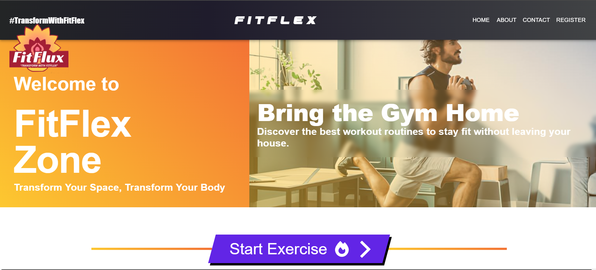
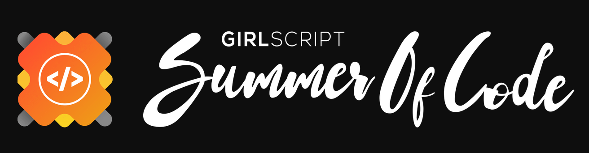
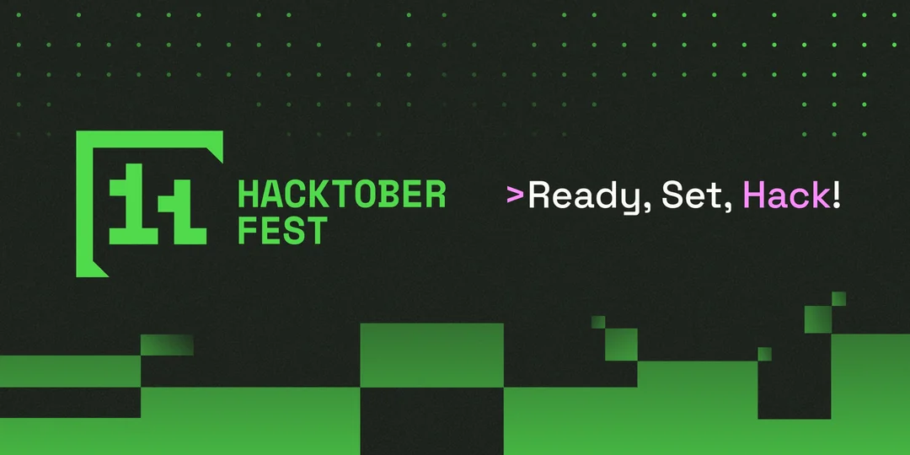

# <p align="center">FITFLEX</p>
  
<p align="center">
  
</p>


<div align="center">
    <br>
   <!-- Table for GitHub Repo Stats -->
    <table align="center" border="1" cellpadding="10" cellspacing="0">
        <thead align="center">
            <tr>
                <td><b>🌟 Stars</b></td>
                <td><b>🍴 Forks</b></td>
                <td><b>🐛 Issues</b></td>
                <td><b>🔔 Open PRs</b></td>
                <td><b>🔕 Closed PRs</b></td>
                <td><b>🛠️ Languages</b></td>
                <td><b>🌐 Contributors</b></td>
            </tr>
        </thead>
        <tbody align="center">
            <tr>
                <td></td>
                <td></td>
                <td></td>
                <td></td>
                <td></td>
                <td></td>
                <td></td>
            </tr>
        </tbody>
    </table>
    
<br>
  <!-- Repository link -->
    <a href="https://github.com/Open-Code-Crafters/FitFlex" target="_blank">
        <strong>Check out the FitFlex repository on GitHub</strong>
    </a>
</div>


<div>
  <h2>Table of Contents</h2>
  <ul>
    <li><a href="#about-fitflex">About FITFLEX</a></li>
    <li><a href="#tech-stack">Tech Stack</a></li>
    <li><a href="#what-can-you-contribute">What can you contribute?</a></li>
    <li><a href="#how-to-contribute">How to contribute?</a></li>
    <li><a href="#how-to-make-a-pull-request">How to make a pull request?</a></li>
    <li><a href="#project-contributors">Project Contributors</a></li>
    <li><a href="#license">License</a></li>
</ul>
  
<h2>📌 Open Source Program</h2>

<h3> This project is now OFFICIALLY accepted for</h3>

  
  


  <h2 id="about-fitflex">About FITFLEX</h2>
FitFlex is a fitness and weight loss website that offers daily, structured workout plans for a set period. Users can follow day-wise exercises tailored to their goals, whether it’s for weight loss, muscle gain, or general fitness. FitFlex provides a simple, user-friendly interface to help track progress and stay consistent throughout the fitness journey.

We also have a Discord server to discuss doubts and suggestions! Make sure to join it here: <br />
<br />
[](https://discord.gg/hHAUcQj3)

# Tech-Stack

<p align="center">
   
   
  
  
</p>


<h2 id="what-can-you-contribute">What can you contribute?</h2>

- Find All the details in [**CONTRIBUTING.md**](https://github.com/Open-Code-Crafters/FitFlex/blob/main/CONTRIBUTING.md) before contributing
- Please follow guidelines in [**Code_of_Conduct.md**](https://github.com/Open-Code-Crafters/FitFlex/blob/main/CODE_OF_CONDUCT.md)

<h2 id="how-to-contribute">How to contribute?</h2>

- Drop a Star in this repo
- Take a look at the existing [Issues](https://github.com/Open-Code-Crafters/FitFlex/issues).
- Fork the Repo create a branch for any issue that you are working on and commit your work.
- At first raise an issue in which you want to work
- **Please do not make more than 2 issues at a time , Once your PR have been merged only then go for the next issue**
- **Then when you are get assigned only then work on that issue & make a PR**
- Please try to make a separate branch in your fork in case of PR
- Create a [**Pull Request**](https://github.com/Open-Code-Crafters/FitFlex/pulls), which will be promptly reviewed and given suggestions for improvements by the community.
- **REMINDER: Commit inside **the `Projects`** Folder**
- Find the already Existing Projects in the `Projects` Folder
- Add screenshots or video prototypes to your Pull Request to help us understand the effects of the changes that are included in your commits.

<h2> Installation and Setup</h2>

<h3> Prerequisites</h3>

- Node.js
- npm

<h3> Steps</h3>

1. **Clone the repository**:
   ```bash
   git clone https://github.com/Open-Code-Crafters/FitFlex.git
   ```
2. **Navigate to the project directory**:
    ```bash
   cd FitFlex
   ```
  
3. **Install Dependencies**:
    ```bash
   npm install
   ```
4. **Run the project**:
   ```bash
   npm run dev
   ```
5. **Contribution Guidelines**
Move detailed steps to a new `CONTRIBUTING.md` file and link to it:

<h3> Steps using Docker</h3>

1. **Clone the repository**:
   ```bash
   git clone https://github.com/Open-Code-Crafters/FitFlex.git
   ```
2. **Navigate to the project directory**:
    ```bash
   cd FitFlex
   ```
  
3. **Install Docker Image**:
    ```bash
   docker build -t my-app .
   ```
4. **Run Docker Image**:
   ```bash
   docker run -p 5173:5173 my-app
   ```
5. **Steps to get Docker Desktop for running the application using docker**
    Go to "https://www.docker.com/products/docker-desktop/" and download Docker Desktop for Mac/Windows/Linux
  


<p align="right"><a href="#top"></a></p>

<h2 id="how-to-make-a-pull-request">How to make a Pull Request?</h2>


**1.** Start by forking the [**FITFLEX**](https://github.com/Open-Code-Crafters/FitFlex) repository. Click on the <a href="https://github.com/Open-Code-Crafters/FitFlex/fork"></a> symbol at the top right corner.

**2.** Clone your forked repository:

```bash
git clone https://github.com/<your-github-username>/FitFlex
```

**3.** Navigate to the new project directory:

```bash
cd FitFlex
```

**4.** Set upstream command:

```bash
git remote add upstream https://github.com/Open-Code-Crafters/FitFlex
```

**5.** Create a new branch:

```bash
git checkout -b YourBranchName
```

<i>or</i>

```bash
git branch YourBranchName
git switch YourBranchName
```

**6.** Sync your fork or local repository with the origin repository:

- In your forked repository click on `Fetch upstream`.
- Click `Fetch and merge`.

<h3> Alternatively, Git CLI way to Sync forked repository with origin repository:</h3>

```bash
git fetch upstream
```

```bash
git merge upstream/main
```

<h3 id="github-docs-syncing">Github Docs for Syncing</h3>
<a href="https://docs.github.com/en/github/collaborating-with-pull-requests/addressing-merge-conflicts/resolving-a-merge-conflict-on-github">Read the documentation</a>

**7.** Make your changes to the source code.

**8.** Stage your changes and commit:

⚠️ **Make sure** not to commit `package.json` or `package-lock.json` file

⚠️ **Make sure** not to run the commands `git add .` or `git add *`. Instead, stage your changes for each file/folder

```bash
git add file/folder
```

```bash
git commit -m "<your_commit_message>"
```

**9.** Push your local commits to the remote repository:

```bash
git push origin YourBranchName
```

**10.** Create a [Pull Request](https://help.github.com/en/github/collaborating-with-issues-and-pull-requests/creating-a-pull-request)!

**Congratulations! You've made your first contribution!** 🙌🏼

<p align="right"><a href="#top"></a></p>

<h2 id="project-contributors">Project Contributors</h2>

<p align ="center">
  
</p>
<div align="center">
<a  href="https://github.com/Open-Code-Crafters/FitFlex/graphs/contributors">
  
</a> 

---
## Stargazers ❤️

<div align='left'>

[](https://github.com/Open-Code-Crafters/FitFlex/stargazers)

</div>

## Forkers ❤️

[](https://github.com/Open-Code-Crafters/FitFlex/network/members)
 
# License


<div align="center">
</br>
<p align = "center">
Show some ❤️&nbsp; by giving  to this repo
</p>

<p align="right"><a href="#top"></a></p>

