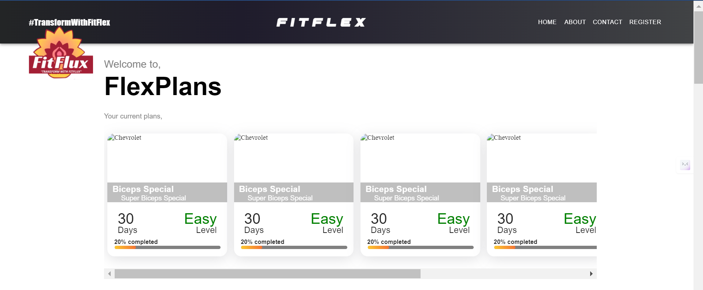
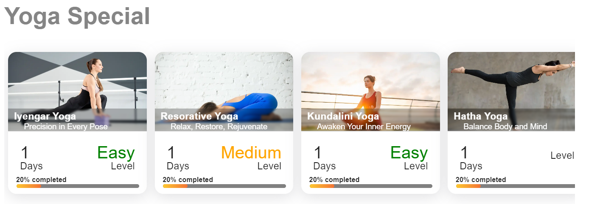
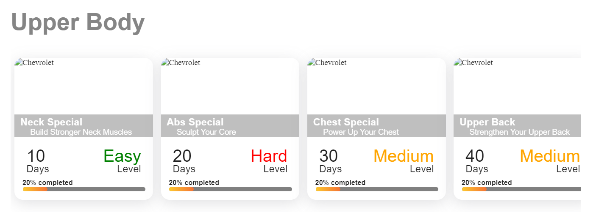
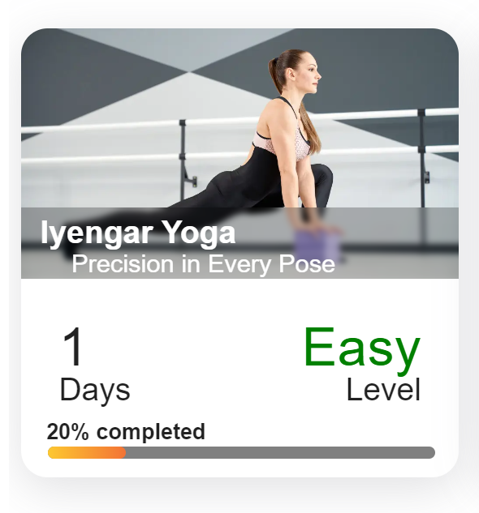

# Fitness-Website

FitFlex is a fitness and weight loss website that offers daily, structured workout plans for a set period. Users can follow day-wise exercises tailored to their goals, whether it’s for weight loss, muscle gain, or general fitness. FitFlex provides a simple, user-friendly interface to help track progress and stay consistent throughout the fitness journey.

# Tech Stack

   
   
  
  

# Features

 
  • Daily workout plans tailored to individual goals.  
    
    
  <ol>
     <li> FlexPlans     
          
      </li>
       
      <li> Yoga Special     
          
      </li>
       
      <li> Upper Body     
          
      </li>
      <b>  Many more....</b>
   </ol>

 
  • Track progress and stay consistent.     
   

# Getting Started

Follow these instructions to set up the project on your local machine.

1.  Installation

    • Fork the Repository

    • Go to the FitFlex repository and click the "Fork" button at the top-right corner to create a copy of this repository under your GitHub account.

2.  Clone the Forked Repository

    • Clone the repository to your local machine by running:

    • To clone the repository :

        git clone https://github.com/your-username/FitFlex.git

    • To change directory :

        cd FitFlex

3.  After navigating into the project directory, install the required dependencies:

    • Install the node modules:

        npm install

    • To Start the project locally:

         npm run dev

    • The application will be available at http://localhost:portNumber

4.  Create a New Branch (For Contributing)

         git checkout -b feature/your-feature-name

    • Make Changes

    • Implement your changes, following the coding conventions of the project.

5.  Commit Changes

    • Stage all Changes:

        git add .

    • Commit all Staged changes:

        git commit -m "feat: describe the feature you added"

6.  Push your changes to your forked repository:

        git push origin feature/your-feature-name

7.  Create a Pull Request

    • Go to the original repository on GitHub and submit a pull request.

# License

This project is licensed under the MIT License.

# Thank You

Thank you for visiting and using FitFlex!. We truly appreciate your interest in our project.
Whether you're a user improving your fitness journey or a developer contributing to the codebase, your support is invaluable.
